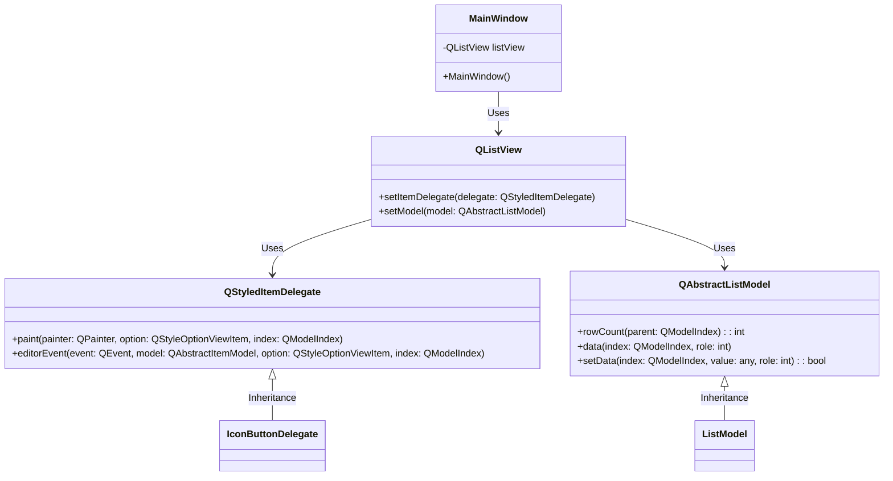

## ModelView

```mermaid
classDiagram
    class MainWindow{
        -QListView listView
        +MainWindow()
    }
    class QListView{
        +setItemDelegate(delegate: QStyledItemDelegate)
        +setModel(model: QAbstractListModel)
    }
    class QStyledItemDelegate{
        +paint(painter: QPainter, option: QStyleOptionViewItem, index: QModelIndex)
        +editorEvent(event: QEvent, model: QAbstractItemModel, option: QStyleOptionViewItem, index: QModelIndex)
    }
    class QAbstractListModel{
        +rowCount(parent: QModelIndex): int
        +data(index: QModelIndex, role: int)
        +setData(index: QModelIndex, value: any, role: int): bool
    }
    MainWindow --> QListView: Uses
    QListView --> QStyledItemDelegate: Uses
    QListView --> QAbstractListModel: Uses
    QStyledItemDelegate <|-- IconButtonDelegate: Inheritance
    QAbstractListModel <|-- ListModel: Inheritance
```